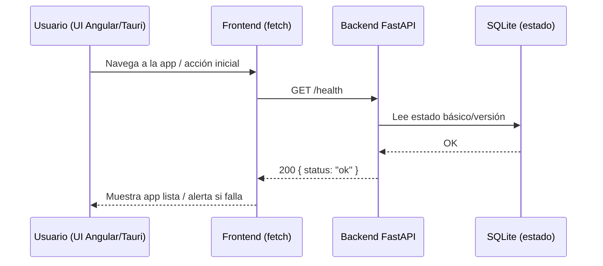
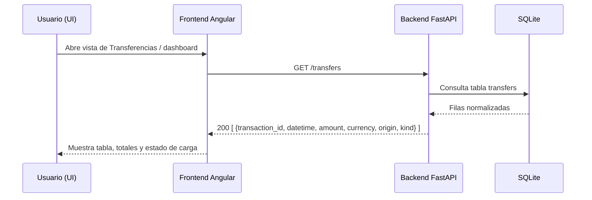
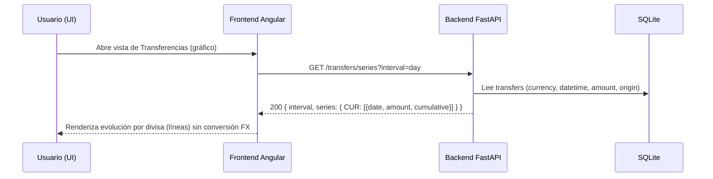
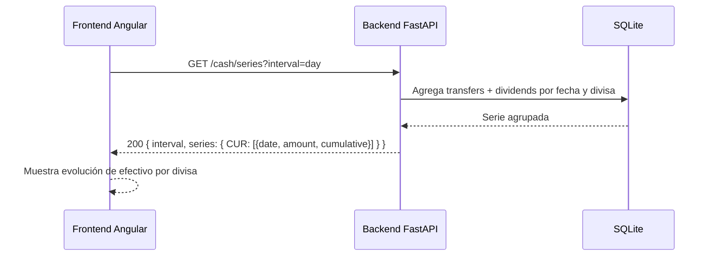
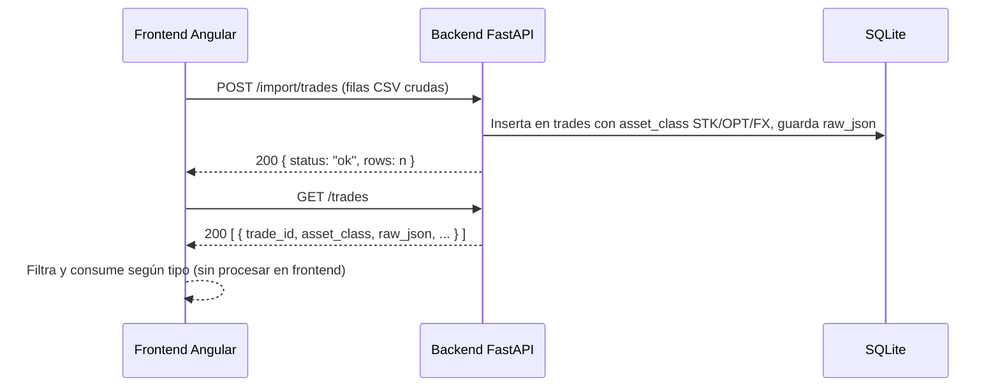
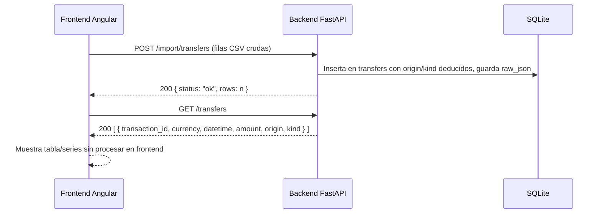
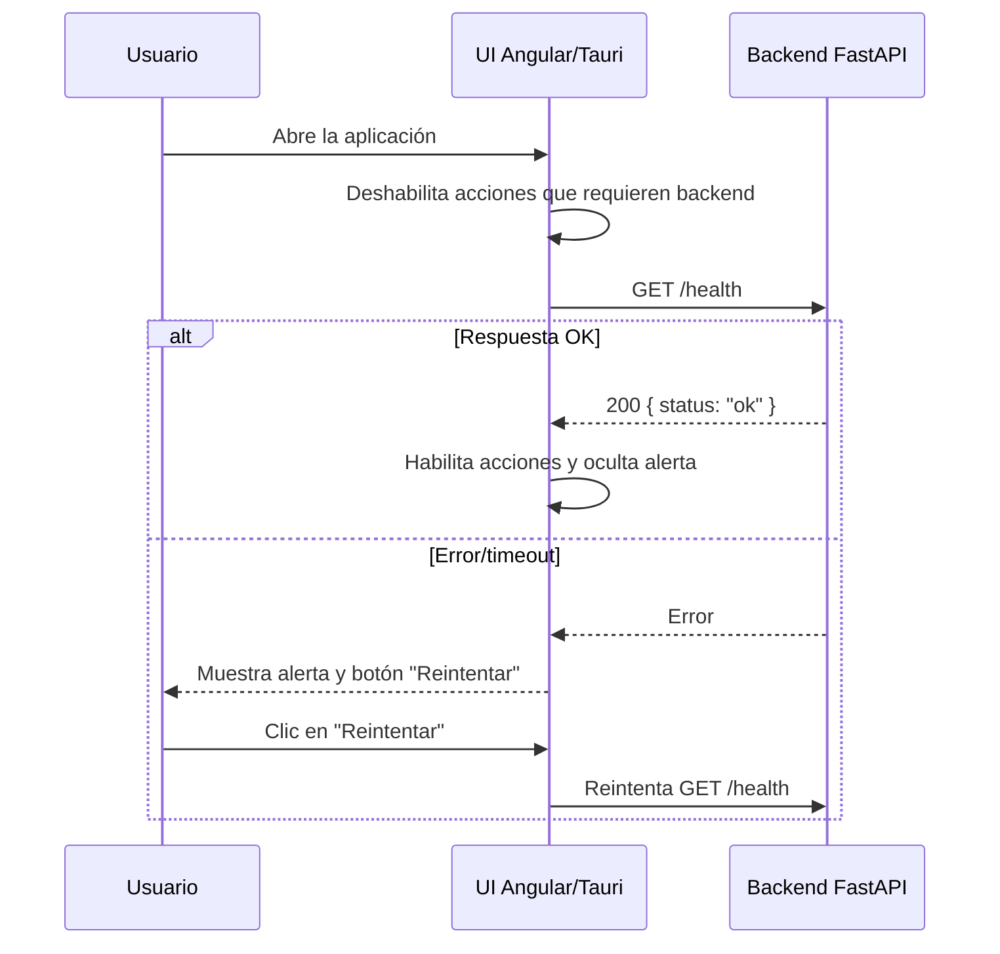
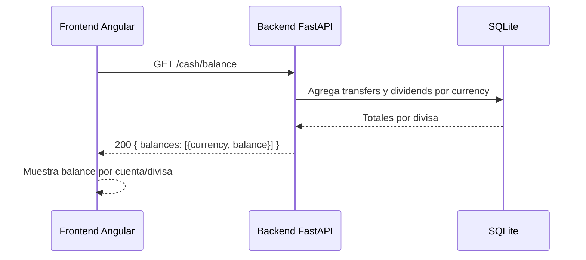

# Endpoints del backend

- `GET /health`: estado básico.
- `POST /import/transfers`: recibe filas de transferencias (JSON) y las almacena en SQLite.
- `POST /import/trades`: recibe operaciones (JSON) y las almacena.
- `POST /import/dividends`: recibe dividendos (JSON) y los almacena.
- `GET /transfers`: lista transferencias con `transaction_id`, `currency`, `datetime`, `amount`, `origin`, `kind`.
- `GET /cash/net-transfers`: suma aportes/retiros externos por rango (`from_date`, `to_date`) y moneda base; filtra `origin='externo'`.
- `GET /trades`: lista operaciones.
- `POST /prices/sync`: sincroniza precios de tickers con Yahoo.
- `POST /prices/latest`: devuelve último precio por ticker.
- `GET /prices/{ticker}`: serie histórica del ticker.
- `GET /dividends`: lista dividendos.
- `GET /config`: devuelve configuración actual (moneda base).
- `POST /config/base-currency`: actualiza moneda base.
- `POST /fx/rate`: guarda/actualiza un tipo de cambio diario (base, quote, rate, fecha opcional).
- `GET /portfolio/value`: devuelve valor total del portafolio (efectivo + posiciones) en moneda base con desglose.
- `GET /transfers/series`: serie temporal de transferencias por divisa (sin conversión FX).
- `GET /cash/balance`: balance por divisa (transferencias + dividendos, sin FX).
- `GET /cash/series`: serie temporal de efectivo por divisa (transferencias + dividendos, sin FX).
- `POST /import/trades`: importa filas crudas de operaciones y las clasifica/persiste en trades (STK/OPT/FX).
- `POST /import/transfers`: importa filas crudas de transferencias/FX y las persiste en transfers.

## Flujos (Mermaid)

### GET /health

Descripción: endpoint de chequeo rápido que confirma que FastAPI responde y la base SQLite es accesible. Se invoca al cargar la app o al abrir la ventana de Tauri para verificar disponibilidad.

### GET /transfers

Descripción: devuelve la lista de transferencias normalizadas con `transaction_id`, `currency`, `datetime`, `amount`, `origin`, `kind`. Usado por la UI para tablas y cálculo de aportes/retiros. Puede filtrarse en frontend por rango y origen.

### GET /transfers/series

Descripción: devuelve serie temporal de transferencias por divisa sin convertir FX, acumulando transferencias externas e internas; el backend agrega por día o mes y devuelve el acumulado por divisa.

### GET /cash/series

Descripción: devuelve serie temporal de efectivo por divisa sin convertir FX, sumando transferencias (externas e internas) y dividendos; agrega por día o mes e incluye acumulado.

### POST /import/trades

Descripción: recibe filas crudas del CSV de operaciones y las clasifica en backend; persiste compras/ventas STK, primas/asignaciones de opciones (OPT) y movimientos FX/cash en `trades` con `asset_class` y `raw_json` intacto.

### POST /import/transfers

Descripción: recibe filas crudas de transferencias y FX (CSV) y las normaliza en el backend, guardándolas en la tabla `transfers` con `origin/kind` y `raw_json`. Ignora operaciones STK/OPT; FX internas se marcan como `fx_interno`.

Flujo de arranque con bloqueo de acciones (REQ-UI-0020):

### GET /cash/balance

Descripción: devuelve el balance por divisa sin convertir FX, sumando transferencias (externas e internas) y dividendos; no incluye valoración de posiciones.

