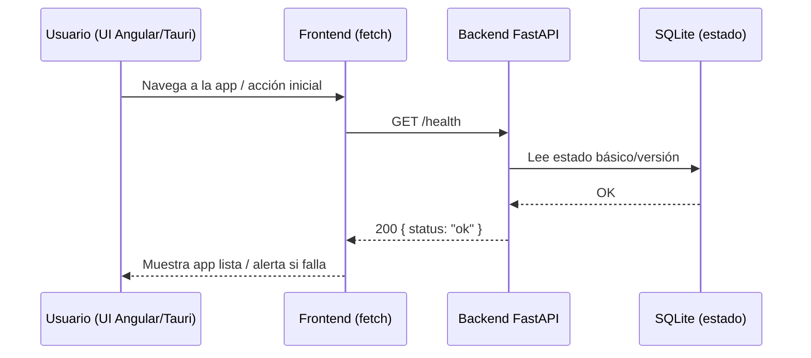
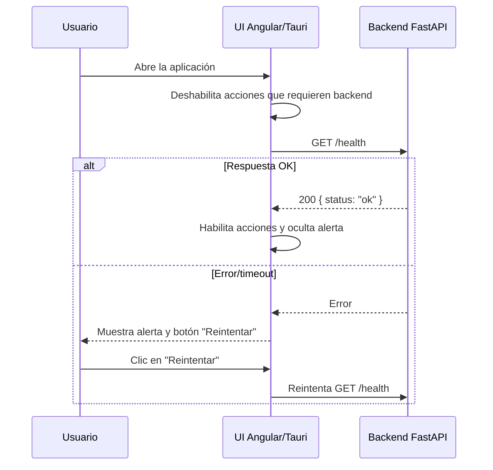

# Endpoints del backend

- `GET /health`: estado básico.
- `POST /import/transfers`: recibe filas de transferencias (JSON) y las almacena en SQLite.
- `POST /import/trades`: recibe operaciones (JSON) y las almacena.
- `POST /import/dividends`: recibe dividendos (JSON) y los almacena.
- `GET /transfers`: lista transferencias con `transaction_id`, `currency`, `datetime`, `amount`, `origin`, `kind`.
- `GET /cash/net-transfers`: suma aportes/retiros externos por rango (`from_date`, `to_date`) y moneda base; filtra `origin='externo'`.
- `GET /trades`: lista operaciones.
- `POST /prices/sync`: sincroniza precios de tickers con Yahoo.
- `POST /prices/latest`: devuelve último precio por ticker.
- `GET /prices/{ticker}`: serie histórica del ticker.
- `GET /dividends`: lista dividendos.
- `GET /config`: devuelve configuración actual (moneda base).
- `POST /config/base-currency`: actualiza moneda base.
- `POST /fx/rate`: guarda/actualiza un tipo de cambio diario (base, quote, rate, fecha opcional).
- `GET /portfolio/value`: devuelve valor total del portafolio (efectivo + posiciones) en moneda base con desglose.

## Flujos (Mermaid)

### GET /health

Descripción: endpoint de chequeo rápido que confirma que FastAPI responde y la base SQLite es accesible. Se invoca al cargar la app o al abrir la ventana de Tauri para verificar disponibilidad.

Flujo de arranque con bloqueo de acciones (REQ-UI-0020):

